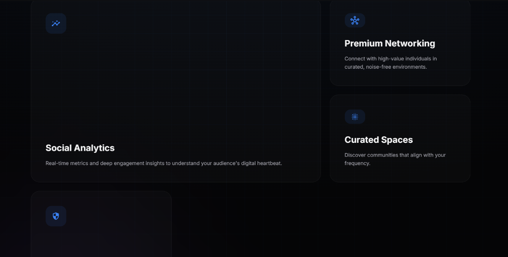
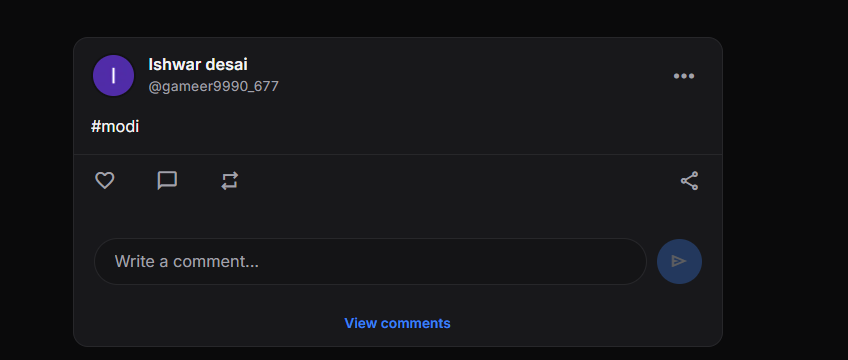
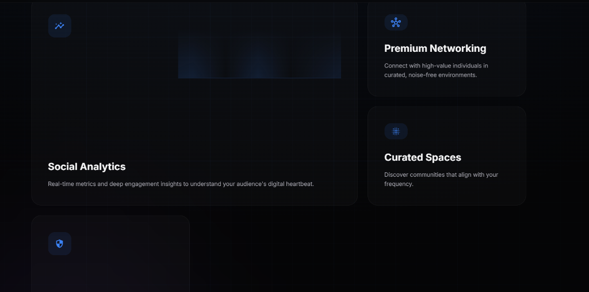
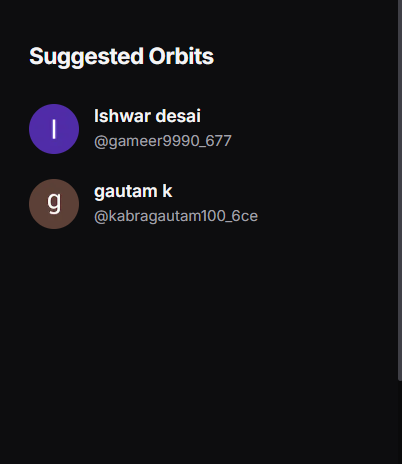

# VibeShare: The Digital Pulse

VibeShare is a premium, high-performance social ecosystem designed for depth and connection. Built with a modern tech stack, it offers a seamless experience for sharing pulses, discovering communities, and analyzing social trends in real-time.

<p align="center">
  
</p>

## ✨ Features

- **The Digital Pulse**: An immersive landing page with dynamic visuals and a balanced bento-grid feature showcase.
- **Secure Authentication**: Robust user management powered by **Clerk** with JWT-verified API protection.
- **Real-time Trending**: A live-updating hashtag system that monitors pulses and comments to highlight the network's heartbeat.
- **Dynamic Profile System**: Customizable user profiles with follow/unfollow capabilities and a dual-view pulse grid.
- **High-Fidelity Media**: Intelligent image handling via **Cloudinary**, featuring optimized uploads and responsive displays.
- **Bento UI Architecture**: A sleek, dark-mode interface designed with premium glassmorphism and subtle micro-animations.

## 📸 Screenshots

| Landing Page | Feed & Trending |
|:---:|:---:|
|  |  |

| Profile View | Create Pulse |
|:---:|:---:|
|  |  |

## 🛠️ Tech Stack

### Frontend
- **Framework**: [Next.js](https://nextjs.org/) (React)
- **State Management**: [SWR](https://swr.vercel.app/) (swr-infinite for feeds)
- **Authentication**: [Clerk](https://clerk.com/)
- **Styling**: Vanilla CSS (Modular) with premium glassmorphism
- **Icons**: Material Symbols & Lucide-React

### Backend
- **Framework**: [FastAPI](https://fastapi.tiangolo.com/) (Python)
- **ORM**: [SQLAlchemy](https://www.sqlalchemy.org/)
- **Database**: [PostgreSQL](https://www.postgresql.org/)
- **Image Storage**: [Cloudinary](https://cloudinary.com/)
- **Security**: JWT Authentication & CORS Protection

## 🚀 Getting Started

### 1. Clone the repository
```bash
git clone https://github.com/your-username/vibeshare.git
```

### 2. Setup Backend
```bash
cd vibeshare-backend-main
pip install -r requirements.txt
# Add your .env (DATABASE_URL, CLOUDINARY_*, CLERK_*)
uvicorn api.main:app --reload
```

### 3. Setup Frontend
```bash
cd vibeshare-frontend-main
npm install
# Add your .env.local (NEXT_PUBLIC_CLERK_*, CLERK_SECRET_KEY, NEXT_PUBLIC_API_URL)
npm run dev
```

## 🌐 Deployment

VibeShare is optimized for deployment on **Vercel**. 
- Deploy the backend using the `@vercel/python` builder (already configured in `vercel.json`).
- Deploy the frontend as a standard Next.js project.
- Connect to a hosted PostgreSQL instance (e.g., Neon or Supabase).

---
<p align="center">Made with ❤️ for the VibeShare community.</p>
